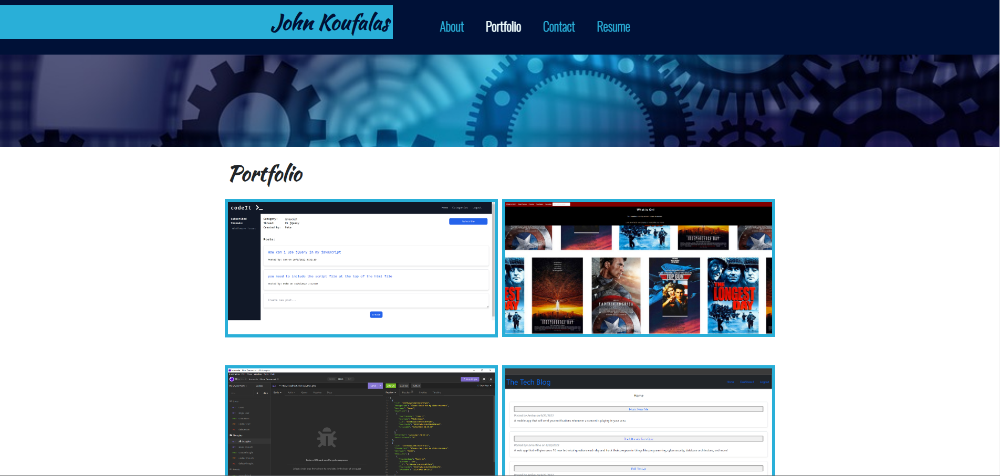

# Professional-Portfolio

## Description

This is a web site dedicated to presenting a portfolio of work to highlight different aspects of full stack development.

There are 4 main areas in this portfolio.

- About Me
  Which outlines a small introduction about me.
- Portfolio
  This is collection of work that i have done.
  There are links to the gitHub pages and deployed project where you can evaluate them.
- Contact
  This is a form that validates input and where a message can be passed.
- Resume
  This has a link to my resume, which can be downloaded and also lists my front end and back end proficiencies.
   

## Table of Contents

- [Deployed Link](#Link)
- [GitHub Link](#github-link)
- [Screenshot](#Screenshot)

---

## Link

The link to the deployed website of the assignment is  
[https://jkoufalas.github.io/React-Portfolio/](https://jkoufalas.github.io/React-Portfolio/)

---

## GitHub Link

The link to the deployed website of the assignment is  
[https://github.com/jkoufalas/React-Portfolio/](https://github.com/jkoufalas/React-Portfolio)

---

## Screenshot

This image provides a sample of the completed website.

